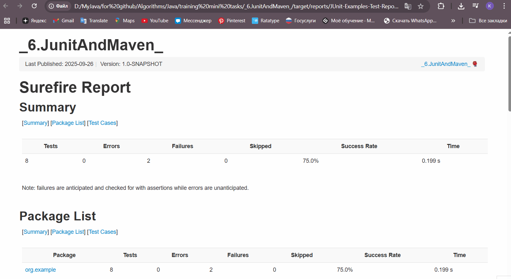
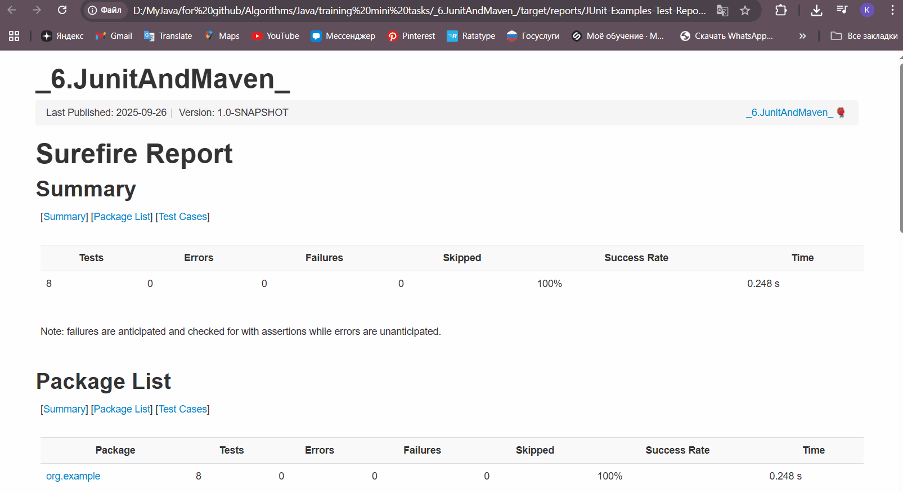
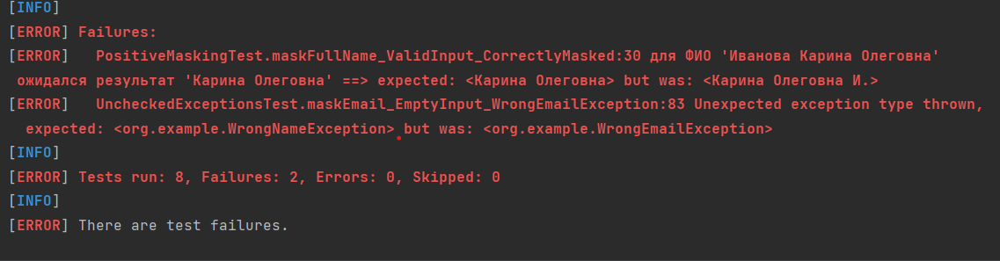
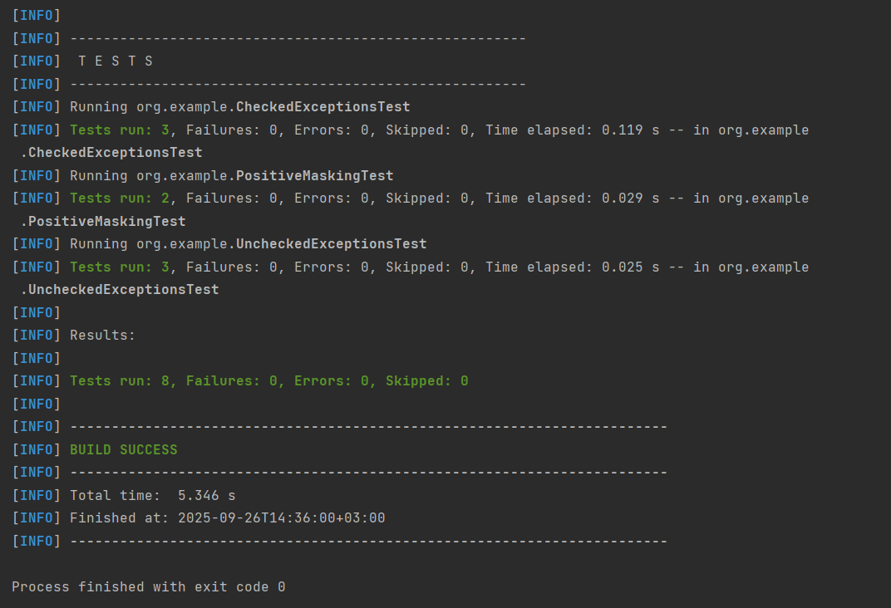

# Запуск тестов на примере задания 2.3 Маскирование

## В виде HTML файла

### специально допущеные ошибки в тестах

### все тесты прошли

## В терминале

### специально допущеные ошибки в тестах

### все тесты прошли

