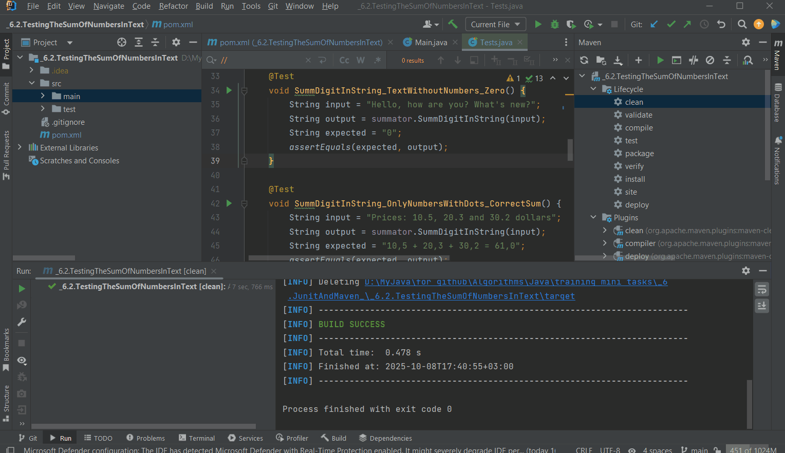

# Запуск тестов

### Все программы из папки "2.OOP and String Processing" переписаны в более тестируемый вид и представлены здесь, 2.2 в 6.1, а 2.3 в 6.2
## Демонстрация полной работы jacoco и surefire-report на примере 2.2 Маскирование ФИО и email


## И обычный запуск тестов для 2.3 Сумма чисел в тексте



## Запуск тестов и генерация отчетов

Этот проект использует Maven для сборки и управления зависимостями. Для запуска тестов и генерации отчетов о покрытии кода и результатах тестирования выполните следующие шаги.

### 📋 Предварительные требования
- **Java 21**
- **Maven 3.6+**

### 🔧 Запуск из командной строки

**Все тесты с отчетами:**
```bash
mvn clean 
mvn surefire-report:report
```

### 📊 Просмотр отчетов

После выполнения команд отчеты появятся в следующих директориях:

| Отчет | Назначение | Расположение |
| :--- | :--- | :--- |
| **JaCoCo** | Покрытие кода (какие строки/ветки выполняются) | `target/site/jacoco/index.html` |
| **Surefire** | Детальные результаты тестов (успешные/неудачные) | `target/reports/JUnit-Examples-Test-Report.html` |

Откройте соответствующие `index.html` или `JUnit-Examples-Test-Report.html` файлы в браузере для просмотра.

### 💡 Важные примечания для пользователей

- **Платформа JavaFX:** В файле `pom.xml` есть настройка `<javafx.platform>win</javafx.platform>`. Если вы работаете под **Linux** или **macOS**, замените значение `win` на `linux` или `mac` соответственно.
- **Аргументы JVM:** Конфигурация `argLine` в `maven-surefire-plugin` содержит специальные параметры для совместимости с Java 21, Mockito и JaCoCo. Это нормальная практика для обеспечения совместной работы этих инструментов.
