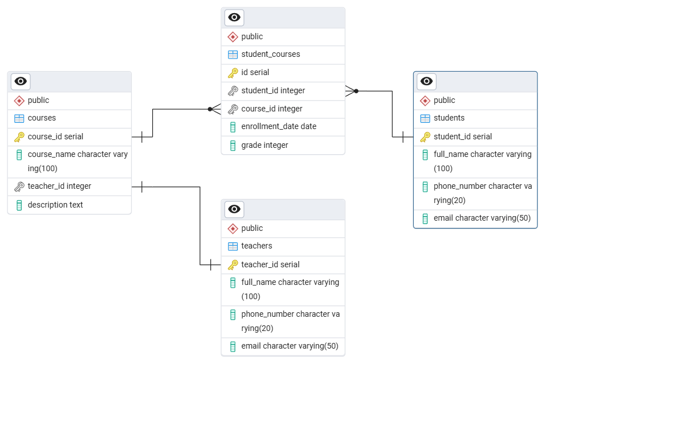

# University Database Management System

### Результат в консоли на примере jdbc реализации, то же самое может jpa

[Демонстрация CRUD и использования DTO в консоли](Console_Result_JDBC.md)

## Описание проекта

Это приложение для управления базой данных учебного заведения, реализованное на Java с использованием Spring Boot и H2 in-memory базы данных. Система предоставляет полный набор CRUD операций для работы с основными сущностями университета: студентами, преподавателями, курсами и записями студентов на курсы.

Проект демонстрирует два различных подхода к работе с базой данных:
- **JDBC реализация** - использование Spring JDBC Template для прямых SQL-запросов
- **JPA реализация** - использование Spring Data JPA и Hibernate ORM для объектно-реляционного отображения

## Архитектура базы данных



### Структура таблиц

**Таблица `teachers` (Преподаватели):**
- `teacher_id` - первичный ключ (автоинкремент)
- `full_name` - ФИО преподавателя (обязательное поле)
- `phone_number` - номер телефона
- `email` - электронная почта

**Таблица `courses` (Курсы):**
- `course_id` - первичный ключ (автоинкремент)
- `name` - название курса (обязательное поле)
- `teacher_id` - внешний ключ к таблице преподавателей
- `description` - описание курса

**Таблица `students` (Студенты):**
- `student_id` - первичный ключ (автоинкремент)
- `full_name` - ФИО студента (обязательное поле)
- `phone_number` - номер телефона
- `email` - электронная почта

**Таблица `student_course` (Связь студенты-курсы):**
- `id` - первичный ключ (автоинкремент)
- `student_id` - внешний ключ к таблице студентов
- `course_id` - внешний ключ к таблице курсов
- `enrollment_date` - дата зачисления на курс
- `grade` - оценка студента по курсу

### Связи между таблицами

- **One-to-One**: Курс и преподаватель (один курс - один преподаватель)
- **One-to-Many**: Студент и записи на курсы, Курс и записи студентов
- **Many-to-Many**: Студенты и курсы связаны через таблицу `student_course`

## Сравнение реализаций

### JDBC Реализация

**Технологический стек:**
- Spring Boot
- Spring JDBC Template
- H2 In-Memory Database
- Ручное управление SQL-запросами

**Особенности:**
- Прямое написание SQL-запросов
- Ручное отображение ResultSet в объекты через RowMapper
- Полный контроль над выполняемыми запросами
- **Автоматическое присвоение сгенерированного ID**: При сохранении новой сущности через `save()` метод, сгенерированный базой данных идентификатор автоматически присваивается объекту в коде с использованием `GeneratedKeyHolder`
- Кастомное форматирование вывода в консоль

**Ключевые классы:**
- `StudentRepository`, `TeacherRepository`, `CourseRepository`, `StudentCourseRepository` - репозитории с JDBC логикой
- `PrintFormatter` - утилита для красивого табличного вывода
- `CourseInfoDTO` - DTO для передачи данных о курсах

### JPA Реализация

**Технологический стек:**
- Spring Boot
- Spring Data JPA
- Hibernate ORM
- H2 In-Memory Database
- Автоматическое управление сущностями

**Особенности:**
- Аннотации JPA для отображения сущностей (`@Entity`, `@Table`, `@Id`, etc.)
- Автоматическая генерация SQL-запросов
- Управление связями через аннотации (`@OneToOne`, `@OneToMany`, `@ManyToOne`)
- Каскадные операции и ленивая загрузка
- Использование JPQL для сложных запросов

**Ключевые классы:**
- `Student`, `Teacher`, `Course`, `StudentCourse` - сущности с JPA аннотациями
- Репозитории-интерфейсы, расширяющие `JpaRepository`
- Встроенные методы CRUD через Spring Data JPA

## Автоматизация разработки

### Использование возможностей IntelliJ IDEA

В процессе разработки активно использовались возможности автоматизации кода в IntelliJ IDEA:

- **Генерация кода через Alt+Insert**: Быстрое создание геттеров, сеттеров, конструкторов, методов `equals()`, `hashCode()` и `toString()`

### Пример автоматически сгенерированного кода:
```java
// Геттеры и сеттеры
public Long getId() {
    return id;
}

public void setId(Long id) {
    this.id = id;
}

// Методы equals и hashCode
@Override
public boolean equals(Object o) {
    if (this == o) return true;
    if (o == null || getClass() != o.getClass()) return false;
    Student student = (Student) o;
    return Objects.equals(id, student.id);
}

@Override
public int hashCode() {
    return Objects.hash(id);
}
```

## Функциональность

### Общая функциональность (обе реализации)

**CRUD операции:**
- ✅ Создание новых записей (студентов, преподавателей, курсов)
- ✅ Чтение записей (по ID и получение всех записей)
- ✅ Обновление существующих записей
- ✅ Удаление записей

**Бизнес-логика:**
- ✅ Запись студентов на курсы
- ✅ Назначение преподавателей на курсы
- ✅ Выставление оценок студентам
- ✅ Получение аналитической информации о курсах

### Уникальные особенности JDBC реализации
- Кастомные SQL-запросы для аналитики
- Красивое табличное форматирование вывода
- Ручная оптимизация запросов
- Полный контроль над транзакциями
- **Автоматическое обновление ID**: После сохранения новой записи, сгенерированный ID немедленно доступен в объекте

### Уникальные особенности JPA реализации
- Автоматическая генерация схемы базы данных
- Управление связями на уровне объектов
- Встроенная поддержка пагинации и сортировки
- Кэширование первого уровня
- Автоматическое управление ID через стратегии генерации

## Структура проекта

### JDBC Реализация
```
src/main/
    ├──java/com/university/
        ├── entity/              # POJO классы
        ├── repository/          # JDBC репозитории
        ├── dto/                 # Data Transfer Objects
        ├── utils/               # Утилиты (PrintFormatter)
        └── UniversityApplication.java
    ├──resources/
        ├── schema.sql           # DDL
        ├── data.sql             # DML
        └── application.properties  
```

### JPA Реализация
```
src/main/
    ├──java/com/university/
        ├── entity/              
        ├── repository/         
        └── UniversityApplication.java
    ├──resources/
        └── application.properties  
```